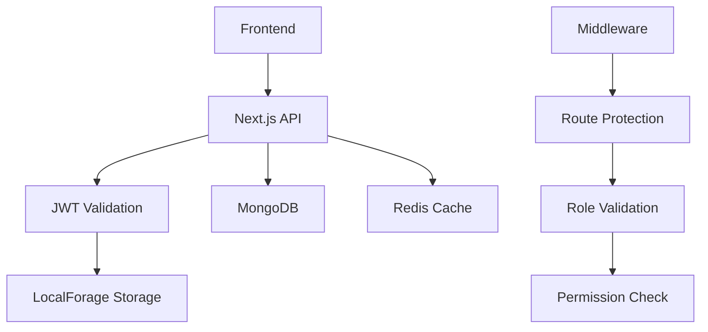

# Integration Points and Dependencies

## External Service Dependencies

### Authentication Services

- **Email Provider**: TBD (SendGrid, Postmark, or Amazon SES)
  - Purpose: Email verification, password reset
  - Integration: SMTP/API for transactional emails
  - Configuration: Environment variables for API keys

### Storage Dependencies

- **MongoDB**: Primary database
  - Connection: MongoDB URI in environment
  - Models: User, Role, Permission, Session
  - Indexes: Email, userId, permissions
- **Redis**: Session and cache storage
  - Connection: Redis URL in environment
  - Usage: Token blacklisting, session storage, rate limiting
  - TTL: Configurable expiration times

### Frontend Dependencies

- **LocalForage**: Client-side secure storage
  - Purpose: JWT token storage with fallback
  - Configuration: Storage instance naming
  - Fallback: IndexedDB → WebSQL → localStorage

## Internal Integration Points

### Authentication Flow Integration



### Data Flow Patterns

#### User Registration Flow

1. **Frontend Form** → Input validation
2. **API Route** → Schema validation (Zod)
3. **Database** → User creation in MongoDB
4. **Email Service** → Verification email
5. **Cache** → Temporary verification token in Redis

#### Authentication Flow

1. **Login Request** → Credentials validation
2. **Token Generation** → JWT access + refresh tokens
3. **Secure Storage** → LocalForage token storage
4. **Session Management** → Redis session tracking
5. **Route Protection** → Middleware validation

#### Permission Flow

1. **Route Access** → Middleware intercepts
2. **Token Validation** → JWT verification
3. **User Lookup** → MongoDB user + roles query
4. **Permission Check** → Role-based validation
5. **Access Decision** → Allow/deny routing

## API Integration Points

### Internal API Structure

```
/api/
├── auth/
│   ├── register
│   ├── login
│   ├── logout
│   ├── refresh
│   ├── verify-email
│   └── reset-password
├── user/
│   ├── profile
│   ├── update
│   └── delete
├── admin/
│   ├── users
│   ├── roles
│   └── permissions
└── health/
    └── status
```

### External API Integrations

- **Email Service API**: RESTful integration for transactional emails
- **Monitoring Service**: Optional APM integration (DataDog, New Relic)
- **Logging Service**: Optional log aggregation (LogRocket, Sentry)

## Environment Configuration

### Required Environment Variables

```bash
# Database
MONGODB_URI=mongodb://localhost:27017/nextauth
REDIS_URL=redis://localhost:6379

# JWT Configuration
JWT_SECRET=your-super-secret-jwt-key
JWT_REFRESH_SECRET=your-refresh-secret-key
JWT_ACCESS_EXPIRY=15m
JWT_REFRESH_EXPIRY=7d

# Email Configuration (TBD)
EMAIL_PROVIDER=sendgrid
EMAIL_API_KEY=your-email-api-key
EMAIL_FROM=noreply@yourapp.com

# Application
NEXTAUTH_URL=http://localhost:3000
NEXTAUTH_SECRET=your-nextauth-secret
NODE_ENV=development

# Security
RATE_LIMIT_REQUESTS=100
RATE_LIMIT_WINDOW=15m
BCRYPT_ROUNDS=12
```

### Docker Service Integration

```yaml
# Services that need to communicate
services:
  app: # Next.js application
  mongodb: # Primary database
  redis: # Cache and sessions
  nginx: # Optional reverse proxy
```

## Component Dependencies

### Frontend Component Tree

```
App Layout
├── AuthProvider (Zustand)
├── ThemeProvider (shadcn/ui)
├── ErrorBoundary
└── Page Components
    ├── Auth Components
    ├── Dashboard Components
    └── Admin Components
```

### Shared Utilities

- **Storage Utils**: LocalForage configuration
- **Auth Utils**: Token management, validation
- **API Utils**: Request/response handling
- **Form Utils**: Validation, error handling

## Third-Party Package Dependencies

### Core Dependencies

```json
{
  "next": "^14.0.0",
  "react": "^18.0.0",
  "typescript": "^5.0.0",
  "tailwindcss": "^3.0.0",
  "zustand": "^4.0.0",
  "localforage": "^1.10.0",
  "mongoose": "^8.0.0",
  "redis": "^4.0.0",
  "jsonwebtoken": "^9.0.0",
  "bcryptjs": "^2.4.0",
  "zod": "^3.0.0"
}
```

### Development Dependencies

```json
{
  "eslint": "^8.0.0",
  "prettier": "^3.0.0",
  "@types/node": "^20.0.0",
  "@types/react": "^18.0.0",
  "jest": "^29.0.0",
  "docker-compose": "file"
}
```

## Deployment Dependencies

### Production Environment

- **Container Registry**: Docker Hub or private registry
- **Orchestration**: Docker Compose or Kubernetes
- **Load Balancer**: Nginx or cloud provider
- **SSL Certificates**: Let's Encrypt or cloud provider
- **Monitoring**: Application and infrastructure monitoring

### Development Environment

- **Docker Desktop**: Local containerization
- **Bun Runtime**: Fast package management and execution
- **VS Code Extensions**: TypeScript, ESLint, Prettier
- **Git Hooks**: Pre-commit validation
